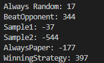
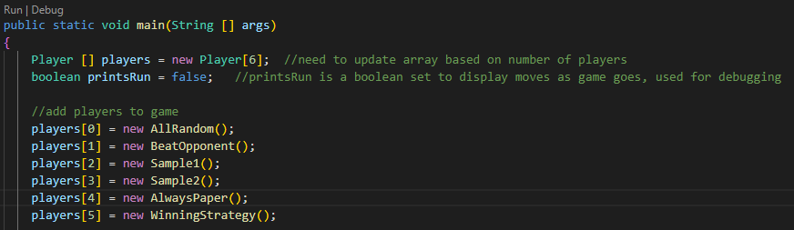

# RockPaperScissors
    
A useful repository designed to test RPS algorithms under the same conditions on competition day. Demonstrates 1st place RPS algorithm submitted to Foothill High School 2024 Rock Paper Scissors programming competition.

## ✨ Features
* A round robin competition that can test many strategies against each other
* Easy to add new strategies with custom algorithms thanks to the Player interface

## 💻 Tech Stack

## 📝 How to use
Simulate competitions with any algorithm/strategy you can imagine. Add in your own algorithm file or play around with the ones provided.
  1. Add your custom strategy as a .java file (similar to Sample1.java)
  2. Make sure your file implements Player
  3. Go to Main.java (line 11) and adjust the "players" list to include the desired strategies (Follow comments in Main for more details)
     
### Prerequisites
None

### Installation
1. Clone the repo:
   \`\`\`bash
   git clone https://github.com/Nick-Maehr/RockPaperScissors
   \`\`\`
2. Enjoy

## 🧠 Lessons Learned
* In-depth practice with recursion across multiple files
* Integration with provided/pre-existing code
* Designing logic-based prediction systems, which eventually won the competition

## 📸 SampleImages

   
  

